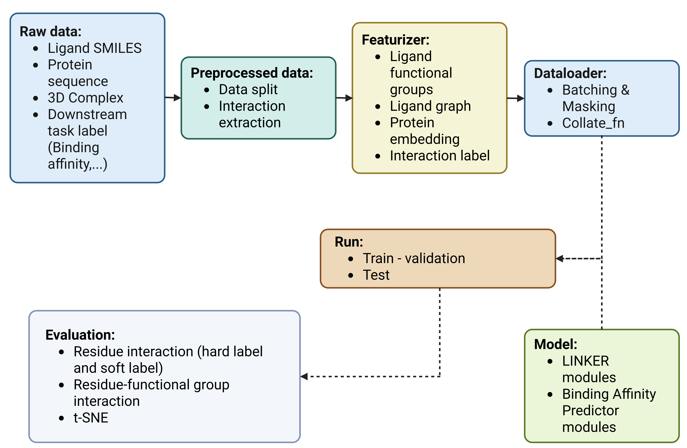

# LINKER: Learning Interactions Between Functional Groups and Residues with Chemical Knowledge-Enhanced Reasoning and Explainability

LINKER is a framework for modeling and explaining protein–ligand interactions by explicitly learning interactions between ligand functional groups and protein residues. The method integrates chemical knowledge, structural information, and deep learning to improve interpretability in structure-based drug discovery.


---

## LINKER Architecture

<p align="center">
  
</p>


## LINKER Codeflow 

<p align="center">
  
</p>

---

## Dependencies

LINKER relies on the following external tools and libraries:

- **PLIP** – Protein–Ligand Interaction Profiler  
- **pyCheckmol** – Functional group detection  
- **Open Babel (obabel)** – Molecular file conversion and processing  
- **ESMC** – Protein language model embeddings  

Please make sure these tools are installed and accessible in your environment before running the pipeline.

---

## Datasets

We use publicly available protein–ligand complex datasets:
- **Leak-Proof PDBBind (LP-PDBBind)**  
  https://github.com/THGLab/LP-PDBBind

- **BindingDB 3D Complexes**  
  https://www.bindingdb.org/rwd/data/surflex/surflex.tar

---

## Pipeline

### 1. Preprocessing 

Preprocess raw BindingDB 3D complexes, including structure cleaning and filtering.
```bash
bash script/PDBBindPreprocessing.sh
```


Preprocess the PDBBind dataset and split it according to LP_PDBBind.
```bash
bash script/BindingDBPreprocessing.sh
```
### 2. Featurizer 
Extract chemical and structural features from processed protein–ligand complexes, including functional group annotations and residue-level representations.
```bash
bash script/PDBBindFeaturizer.sh
bash script/BindingDBFeaturizer.sh
```
### 3. Dataloader 
Construct datasets and dataloaders with batching, masking, and padding strategies for efficient model training.
```bash
bash script/Dataloader.sh
```
### 4. Run 
Train the **LINKER** model on the prepared dataset and save checkpoints:
```bash
bash script/Run_LINKER.sh
```
Train the **Binding Affinity** model on the pretrained features and save checkpoints:
```bash
bash script/Run_Predictor.sh
```
## Acknowledgement

- **[PLIP](https://github.com/pharmai/plip):** Protein-Ligand Interaction Profiler (PLIP)
```bibtex
@article{salentin2015plip,
  title={PLIP: fully automated protein--ligand interaction profiler},
  author={Salentin, Sebastian and Schreiber, Sven and Haupt, V Joachim and Adasme, Melissa F and Schroeder, Michael},
  journal={Nucleic acids research},
  volume={43},
  number={W1},
  pages={W443--W447},
  year={2015},
  publisher={Oxford University Press}
}
```

- **[pyCheckmol](https://github.com/jeffrichardchemistry/pyCheckmol):** Application for detecting functional groups of a molecules

- **[ESMC](https://github.com/evolutionaryscale/esm):** ESM Cambrian creates representations of the underlying biology of proteins
```bibtex
@misc{esm2024cambrian,
  author = {{ESM Team}},
  title = {ESM Cambrian: Revealing the mysteries of proteins with unsupervised learning},
  year = {2024},
  publisher = {EvolutionaryScale Website},
  url = {https://evolutionaryscale.ai/blog/esm-cambrian},
  urldate = {2024-12-04}
}
```


