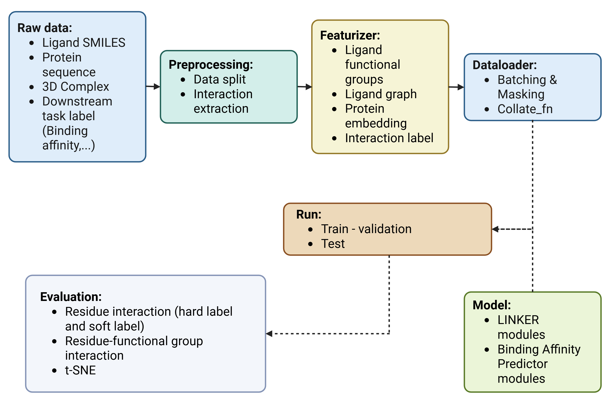

# LINKER: Learning Interactions Between Functional Groups and Residues with Chemical Knowledge-Enhanced Reasoning and Explainability

Published at Journal of Chemical Information and Modeling (JCIM): https://pubs.acs.org/doi/10.1021/acs.jcim.6c00527

Presented at NeurIPS 2025 AI for Science Workshop: https://openreview.net/forum?id=LsDdZUSVso

<p align="center">
  
</p>

LINKER is a framework for modeling and explaining protein–ligand interactions by explicitly learning interactions between ligand functional groups and protein residues. The method integrates chemical knowledge, structural information, and deep learning to improve interpretability in structure-based drug discovery.

---
## Codeflow 

<p align="center">
  
</p>

---

## Environment Setup

First, create the Conda environment required to run **LINKER**.  
This will install all Python libraries and core dependencies needed for the pipeline.

```bash
conda env create -f environment.yml
conda activate linker
```

If you prefer using `pip` instead of Conda, you can install the required packages with:

```bash
pip install -r requirements.txt
```

## External Dependencies

In addition to the Python environment above, LINKER relies on several external tools that must be installed separately. Since each dependency has its own installation procedure, **please install them individually** by following the instructions provided in the `README.md` file inside each corresponding folder.

### Required Tools

- **PLIP** – Protein–Ligand Interaction Profiler  
- **pyCheckmol** – Functional group detection

### Installation Instructions

1. Navigate to each dependency’s folder.
2. Open the `README.md` file inside that folder.
3. Follow the installation steps provided there.
4. Verify that the tool is correctly installed and accessible in your environment

---

## Datasets

We use publicly available protein–ligand complex datasets:
- **Leak-Proof PDBBind (LP-PDBBind)**  

  Repository: https://github.com/THGLab/LP-PDBBind

  First, clone the LP-PDBBind repository into the data/ directory:
  

  Next, download the processed data files from Zenodo: https://zenodo.org/records/18323765

  Place them into the data/LP-PDBBind directory and extract the downloaded files.

  After completing the above steps, the directory structure should look like this:

  ```text
  LINKER/
    ├─ data/
    ├─── LP_PDBBind/
    ├────── complexes/
    ├────── ligands/
    ├────── proteins/
    ├────── ....
    ├────── LP_PDBBind.csv
    ├─ dataloader/
    ├─ ...
  ```
- **BindingDB 3D Complexes**  
  Please download the dataset from: https://www.bindingdb.org/rwd/data/surflex/surflex.tar
  Then extract it into your data/BindingDB directory. After completing the above steps, the directory structure should look like this:
  ```text
  LINKER/
    ├─ data/
    ├─── BindingDB/
    ├────── 1A4H_GDM/
    ├────── 1A9U_SB2/
    ├────── ....
    ├─ dataloader/
    ├─ ...
  ```

- **Davis**  
Please download the dataset from: https://github.com/hkmztrk/DeepDTA/tree/master/data/davis
Then extract it into your data/Davis directory. Or using the preprocessed data:

  ```text
  LINKER/
    ├─ data/
    ├─── Davis/
    ├────── ligands_can.txt/
    ├────── proteins.txt/
    ├────── test_fold.txt/
    ├────── train_folds.txt/
    ├────── Y/
    ├────── Davis_preprocessed.csv/
    ├────── ....
    ├─ dataloader/
    ├─ ...
  ```
The analysis of the Davis dataset is presented in codedebug/DTA_Data.ipynb.

---

## Pipeline

### 1. Preprocessing 

Preprocess raw BindingDB 3D complexes, including structure cleaning and filtering.
```bash
bash script/PDBBindPreprocessing.sh
```


Preprocess the PDBBind dataset and split it according to LP_PDBBind.
```bash
bash script/BindingDBPreprocessing.sh
```

Preprocess the Davis dataset.
```bash
bash script/DTAPreprocessing.sh
```

### 2. Featurizer 
Extract chemical and structural features from processed protein–ligand complexes, including functional group annotations and residue-level representations.
```bash
bash script/PDBBindFeaturizer.sh
bash script/BindingDBFeaturizer.sh
bash script/DTAFeaturizer.sh
```
### 3. Dataloader 
Construct datasets and dataloaders with batching, masking, and padding strategies for efficient model training.
```bash
bash script/Dataloader.sh
```
### 4. Run 
Train the **LINKER** model on the prepared dataset and save checkpoints:
```bash
bash script/Run_LINKER.sh
```
Train the **Binding Affinity** model on the pretrained features and save checkpoints:
```bash
bash script/Run_Predictor.sh
```

Train the **FINGERID-DTA** model on the prepared dataset and save checkpoints:
```bash
bash script/Run_DTA.sh
```


Preliminary versions of this work were presented at NeurIPS 2025 workshops:
- AI for Science: https://openreview.net/pdf?id=LsDdZUSVso 
- Multi-modal Foundation Models and Large Language Models for Life Sciences: https://openreview.net/pdf?id=En4Q41ZA3T
- Machine Learning and the Physical Sciences: https://ml4physicalsciences.github.io/2025/files/NeurIPS_ML4PS_2025_102.pdf 


## Acknowledgement


- **[PLIP](https://github.com/pharmai/plip):** Protein-Ligand Interaction Profiler (PLIP)
```bibtex
@article{salentin2015plip,
  title={PLIP: fully automated protein--ligand interaction profiler},
  author={Salentin, Sebastian and Schreiber, Sven and Haupt, V Joachim and Adasme, Melissa F and Schroeder, Michael},
  journal={Nucleic acids research},
  volume={43},
  number={W1},
  pages={W443--W447},
  year={2015},
  publisher={Oxford University Press}
}
```

- **[pyCheckmol](https://github.com/jeffrichardchemistry/pyCheckmol):** Application for detecting functional groups of a molecules

- **[ESMC](https://github.com/evolutionaryscale/esm):** ESM Cambrian creates representations of the underlying biology of proteins
```bibtex
@misc{esm2024cambrian,
  author = {{ESM Team}},
  title = {ESM Cambrian: Revealing the mysteries of proteins with unsupervised learning},
  year = {2024},
  publisher = {EvolutionaryScale Website},
  url = {https://evolutionaryscale.ai/blog/esm-cambrian},
  urldate = {2024-12-04}
}
```

## If our work is useful, please cite it!

```bibtex
@article{doi:10.1021/acs.jcim.6c00527,
author = {Pham, Phuc and Nguyen, Viet Thanh Duy and Song, Kevin and Chen, Jake and Hy, Truong-Son},
title = {LINKER: Learning Interactions between Functional Groups and Residues with Chemical Knowledge-Enhanced Reasoning and Explainability},
journal = {Journal of Chemical Information and Modeling},
volume = {0},
number = {0},
pages = {null},
year = {0},
doi = {10.1021/acs.jcim.6c00527},
URL = {https://doi.org/10.1021/acs.jcim.6c00527},
eprint = {https://doi.org/10.1021/acs.jcim.6c00527}
}
```

```bibtex
@inproceedings{
pham2025linker,
title={{LINKER}: Learning Interactions Between Functional Groups and Residues With Chemical Knowledge-Enhanced Reasoning and Explainability},
author={Phuc Pham and Viet Thanh Duy Nguyen and Truong-Son Hy},
booktitle={NeurIPS 2025 AI for Science Workshop},
year={2025},
url={https://openreview.net/forum?id=LsDdZUSVso}
}
```
